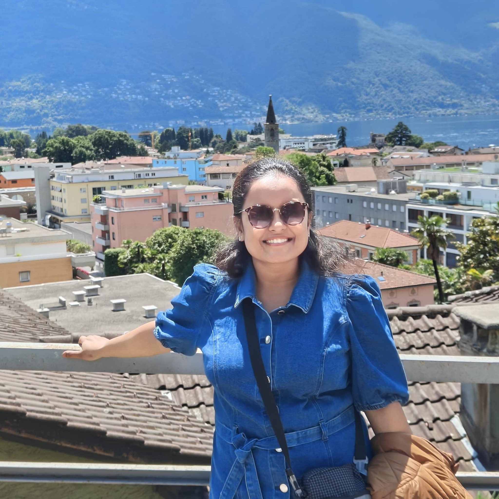

## About Me

I am Soumi Das, a post-doctoral researcher at [Max Planck Institute for Software Systems](https://www.mpi-sws.org/), Saarbruecken advised by [Professor Krishna Gummadi](https://www.mpi-sws.org/people/gummadi/). Presently I'm working on understanding various aspects of large language models like knowledge estimation, privacy-utility-efficiency tradeoffs, and language learning. I have worked in my PhD tenure under the supervision of [Dr. Sourangshu Bhattacharya](http://cse.iitkgp.ac.in/~sourangshu/index.html) in the Department of [Computer Science and Engineering (C.S.E), Indian Institute of Technology (IIT) Kharagpur](http://cse.iitkgp.ac.in) , in the group [Complex NEtwork Research Group (CNeRG)](http://www.cnergres.iitkgp.ac.in/). My research area during PhD broadly spans Machine Learning and Computer Vision and dealing with subset selection problems in the field of data-centric AI. 

## Education
I have completed my **B.Sc (Computer Science Honours)** from **St. Xaviers College** in 2014. Then I completed my **M.Sc (Computer Science)** from the **Institute of Science, Banaras Hindu University (B.H.U)** in 2016. I submitted my PhD thesis entitled [**'Algorithms for online subset selection and data valuation in data-centric AI'**](https://www.dropbox.com/scl/fi/x36ts2ku994seewa3e0e8/SoumiDas_17CS91P08_Thesis.pdf?rlkey=xdzkap675395j5oc7qflpii6g&st=p7lvlb5v&dl=0) at IIT Kharagpur in July 2023. A quick overview of the works can be viewed at this [projects page](https://sites.google.com/view/projectsubset/).

## Publication Lists

1. Abhisek Dash, **Soumi Das**, Elizabeth Kirsten, Qinyuan Wu, Sai Keerthana Karnam, Krishna P. Gummadi, Thorsten Holz, Muhammad Bilal Zafar, Savvas Zannettou, *The Algorithmic Self-Portrait: Deconstructing Memory in ChatGPT*, International Association for Safe \& Ethical AI (IASEAI), 2026 (Non-archival)

2. **Soumi Das**, Camila Kolling, Mohammad Aflah Khan, Mahsa Amani, Bishwamittra Ghosh, Qinyuan Wu, Till Speicher, and  Krishna P. Gummadi, *Revisiting Privacy, Utility, and Efficiency Trade-offs when Fine-Tuning Large Language Models*, International Association for Safe \& Ethical AI (IASEAI), 2026 (Non-archival)

3. Mohammad Aflah Khan, Mahsa Amani, **Soumi Das**, Bishwamittra Ghosh, Qinyuan Wu, Krishna P. Gummadi, Manish Gupta, Abhilasha Ravichander *In Agents We Trust, but Who Do Agents Trust? Latent Source Preferences Steer LLM Generations*, Workshop on Reliable and Responsible Foundation Models: ICML 2025 Workshop [[paper]](https://openreview.net/pdf?id=oZMisPPggL)

4. Qinyuan Wu, **Soumi Das**, Mahsa Amani, Bishwamittra Ghosh, Mohammad Aflah Khan, Krishna P. Gummadi, Muhammad Bilal Zafar *Rote Learning Considered Useful: Generalizing over Memorized Data in LLMs*, The Impact of Memorization on Trustworthy Foundation Models: ICML 2025 Workshop [[paper]](https://openreview.net/pdf?id=vNOA396J3q)

5. Bishwamittra Ghosh, **Soumi Das**, Qinyuan Wu, Mohammad Aflah Khan, Krishna P. Gummadi, Evimaria Terzi, Deepak Garg *Rethinking Memorization Measures in LLMs: Recollection vs. Counterfactual vs. Contextual Memorization*, The Impact of Memorization on Trustworthy Foundation Models: ICML 2025 Workshop [[paper]](https://openreview.net/pdf?id=c6nqmjfG1Y)

6. Qinyuan Wu, Mohammad Aflah Khan, **Soumi Das**, Vedant Nanda, Bishwamittra Ghosh, Camila Kolling, Till Speicher, Laurent Bindschaedler, Krishna P. Gummadi, and Evimaria Terzi,  *Towards Reliable Latent Knowledge Estimation in LLMs: Zero-Prompt Many-Shot Based Factual Knowledge Extraction*, International Conference on Web Search and Data Mining (WSDM 2025)[[paper]](https://arxiv.org/abs/2404.12957) [[code]](https://github.com/SoumiDas/ZeroPrompt_LKE)

7. **Soumi Das**, Manasvi Sagarkar, Suparna Bhattacharya and Sourangshu Bhattacharya, *CheckSelect: Online Checkpoint Selection for Flexible, Accurate, Robust, and Efficient Data Valuation*, IEEE Transactions on Artificial Intelligence (IEEE TAI (2024))[[paper]](https://doi.ieeecomputersociety.org/10.1109/TAI.2024.3506494) [[code]](https://github.com/SoumiDas/CheckSelect)

8. Kiran Purohit, **Soumi Das**, Sourangshu Bhattacharya, and Santu Rana, *LearnDefend: Learning to Defend against Targeted Model-Poisoning Attacks on Federated Learning*, European Conference on Artificial Intelligence, ECAI 2024 [[paper]](https://dro.deakin.edu.au/articles/conference_contribution/A_Data-Driven_Defense_Against_Edge-Case_Model_Poisoning_Attacks_on_Federated_Learning/27663660?file=50374122) [[Slides]](https://drive.google.com/file/d/1wzMbjIDNM_oMrtOrtgsVcWHtMjb3upiE/view?usp=sharing)

9. **Soumi Das**, Shubhadip Nag, Shreyyash Sharma, Suparna Bhattacharya, and Sourangshu Bhattacharya,  *VTruST: Controllable value function based subset selection for Data-Centric Trustworthy AI*, Data-centric Machine Learning Research (DMLR) @ ICLR 2024 [[paper]](https://arxiv.org/abs/2403.05174jkYZU7Q0vQAlIozvT8cnj2aBghmwuCDSGcfSSVh4TI) [[code]](https://github.com/SoumiDas/VTruST) [[Poster]](https://drive.google.com/file/d/1t4Tfo_JTBKiP37AYt1oE7vLKIw9p8Xos/view?usp=sharing)

10. Kiran Purohit, Anurag Parvathgiri, **Soumi Das**, and Sourangshu Bhattacharya,  *Accurate and Efficient Channel pruning via Orthogonal Matching Pursuit*, AIML Systems 2022 [[paper]](https://dl.acm.org/doi/pdf/10.1145/3564121.3564139?casa_token=t3AccMERNZsAAAAA:4KS_vt0cVKbQRNOYYx8NjEpPpOIWKPEd78jkYZU7Q0vQAlIozvT8cnj2aBghmwuCDSGcfSSVh4TI)

11. **Soumi Das**, Harikrishna Patibandla, Suparna Bhattacharya, Kshounis Bera, Niloy Ganguly, and Sourangshu Bhattacharya,  *TMCOSS: Thresholded Multi-Criteria Online Subset Selection for Data-Efficient Autonomous Driving*, ICCV 2021 [[paper]](https://openaccess.thecvf.com/content/ICCV2021/html/Das_TMCOSS_Thresholded_Multi-Criteria_Online_Subset_Selection_for_Data-Efficient_Autonomous_Driving_ICCV_2021_paper.html) [[code]](https://github.com/SoumiDas/TMCOSS) [[Recording]](https://youtu.be/YyzqoJC2NQQ) [[Slides]](https://drive.google.com/file/d/1DtUXcRXbac6R7nWWwHp4DqKFyu5ebJ_o/view?usp=sharing) [[Poster]](https://drive.google.com/file/d/1A98VWbpnXaxpxb8VG-1FZWb05pX9y6Y5/view?usp=sharing)

12. **Soumi Das**, Arshdeep Singh, Saptarshi Chatterjee, Suparna Bhattacharya, and Sourangshu Bhattacharya, *Finding High-Value Training Data Subset through Differentiable Convex Programming*, ECML-PKDD 2021 [[paper]](https://dl.acm.org/doi/10.1007/978-3-030-86520-7_41) [[code]](https://github.com/SoumiDas/HOST-CP) [[Recording]](https://youtu.be/h-Mqu-M2f5A) [[Slides]](https://drive.google.com/file/d/11dotuWI33x2699mezh248iynnbAAeXPU/view?usp=sharing) [[Poster]](https://drive.google.com/file/d/1Hbm8bgRaLxGksDR9FU2F-k32ltqDHsxF/view?usp=sharing)

13. **Soumi Das**, Sayan Mandal, Ashwin Bhoyar, Madhumita Bharde, Niloy Ganguly, Suparna Bhattacharya, and Sourangshu Bhattacharya, *Multi-criteria online frame-subset selection for autonomous vehicle videos*, Pattern Recognition Letters (2020) [[paper]](https://doi.org/10.1016/j.patrec.2020.03.031)

## Preprints

1. **Soumi Das**, Camila Kolling, Mohammad Aflah Khan, Mahsa Amani, Bishwamittra Ghosh, Qinyuan Wu, Till Speicher, and  Krishna P. Gummadi, *Revisiting Privacy, Utility, and Efficiency Trade-offs when Fine-Tuning Large Language Models* [[paper]](https://arxiv.org/abs/2502.13313)

2. Till Speicher, Mohammad Aflah Khan, Qinyuan Wu, Vedant Nanda, **Soumi Das**, Bishwamittra Ghosh, Krishna P. Gummadi, and Evimaria Terzi , *Understanding Memorisation in LLMs: Dynamics, Influencing Factors, and Implications* [[paper]](https://arxiv.org/abs/2407.19262)

3. **Soumi Das**, Rajath Nandan Kalava, Kolli Kiran Kumar, Akhil Kandregula, Kalpam Suhaas, Sourangshu Bhattacharya, and Niloy Ganguly, *Map Enhanced Route Travel Time Prediction using Deep Neural Networks* [[paper]](https://arxiv.org/pdf/1911.02623.pdf)

## Teachings

I am teaching a seminar course on **Efficient Training of Large Language Models : From Basics to Fine-tuning** at MPI-SWS and University of Saarland for the Winter Semester of 2025-2026. The detailed lectures, assignments, reading lists can be found [here](https://gitlab.mpi-sws.org/ns/efficient-training-of-llms).

| Topic | Slides |
| ----- | ------ |
| Building blocks of Large Language Models | [Lecture 1 & 2](https://drive.google.com/file/d/1p-2QxJDdUDsnzWwZr-Fzy06yXFGHxp--/view?usp=sharing)
| Phases of training Large Language Models | [Lecture 3](https://drive.google.com/file/d/19CTjOj0T5gbvXcDWh5YB7g46XQF9A_TR/view?usp=sharing)
| Hands-on Session I : Coding GPT2 from scratch| [Lecture 4](https://drive.google.com/drive/folders/1_oy44HRPgrVy4DzwXQOpFGs3BGKDQ_79?usp=sharing)
| System Level Optimisation - Part I| [Lecture 5](https://drive.google.com/file/d/1SyC5qWgtBu7gtRETKEQnhPWgm7MRcrz3/view?usp=sharing)
| System Level Optimisation - Part II| [Lecture 6](https://drive.google.com/file/d/1pWSfEdXQqtTeLsVI4wYUATPvkHLLlDr3/view?usp=sharing) , [Notebook](https://drive.google.com/file/d/1lFytHmss7aVeAOpILKufRVrczxGYBudh/view?usp=sharing)
| System Level Optimisation - Part III| [Lecture 7](https://drive.google.com/file/d/1vqISZeooIfQ4WBkS3AxvRCfZ4fIoZoaX/view?usp=sharing)
| System Level Optimisation - Part IV| [Lecture 8](https://drive.google.com/file/d/1FPmEtcvCxq_0Y8ZsQZQn5PaP0c59k_pA/view?usp=sharing)

## Presentations on different topics

1. [Responsible LLM Engineering - From Architecture to Privacy-Aware Fine-tuning](https://drive.google.com/file/d/1HUW5pMmel6hSVGpAD8sG-MSVyBGea2uK/view?usp=sharing)

2. [Function Vectors in Large Language Models, ICLR 2024](https://docs.google.com/presentation/d/1NJ12T62CM1tiPFnWMD_v96-fqZOm_PeanVLsfEpOmVQ/edit?usp=sharing)

3. [Are Emergent Abilities of Large Language Models a Mirage?, NeurIPS 2023](https://docs.google.com/presentation/d/1Vvbo7jrn2k9TTuPpXKfHQD_3zRdf12tqaU9NLYa9zPo/edit?usp=sharing)

4. [Explainability in Computer Vision](https://www.dropbox.com/s/q9i4c5sqznx1vhv/Winter_school_FAccT_AI.pdf?dl=0)

5. [Explainability or Interpretability?](https://www.dropbox.com/s/c988oz1kzrg18p4/Expl-Interp-ReadingGroup.pdf?dl=0)

6. [PhD Thesis - Algorithms for online subset selection and data valuation in data-centric AI](https://docs.google.com/presentation/d/1OYNf5BO7R4n9fx2M7ie0JCSN8WtO0N_BVDf7bu4zTuc/edit?usp=sharing)

## Curriculum Vitae

[CV](https://www.dropbox.com/s/7ygq66288u0sfuj/Soumi_CV.pdf?dl=0)

## Contact

You can reach me through email at *soumid.04 [at] gmail [dot] com* 

LinkedIn: [soumi-das](https://www.linkedin.com/in/soumi-das/)

Twitter Handle: [soumi_das0407](https://twitter.com/soumi_das0407)
